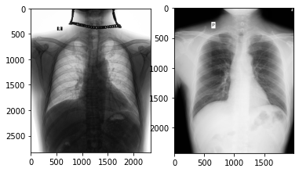
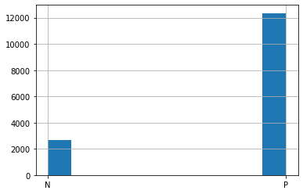
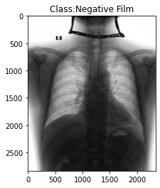

## Chest Xray positive/negative film classification - 胸部X光正負片分類
因日後論文需要，所以train了一個clssifier分類影像為正片or負片

### load model直接使用: classification_model_1_1.h5

- dataset: from kaggle VinBigData Chest X-ray Abnormalities Detection --> https://www.kaggle.com/c/vinbigdata-chest-xray-abnormalities-detection/data
- class: 2類 (P & N) --> {'N': 0, 'P': 1}
- training data: 15000 (因正負片比例不均，約4:1，所以採1:1訓練)
- testing data: 3000 (for this classifation, I labeled 500 for testing)

### Model:
model仿AlexNet進行訓練
```
Model: "sequential"
_________________________________________________________________
Layer (type)                 Output Shape              Param #   
=================================================================
conv2d (Conv2D)              (None, 128, 128, 32)      896       
_________________________________________________________________
batch_normalization (BatchNo (None, 128, 128, 32)      128       
_________________________________________________________________
activation (Activation)      (None, 128, 128, 32)      0         
_________________________________________________________________
max_pooling2d (MaxPooling2D) (None, 64, 64, 32)        0         
_________________________________________________________________
dropout (Dropout)            (None, 64, 64, 32)        0         
_________________________________________________________________
conv2d_1 (Conv2D)            (None, 64, 64, 64)        18496     
_________________________________________________________________
batch_normalization_1 (Batch (None, 64, 64, 64)        256       
_________________________________________________________________
activation_1 (Activation)    (None, 64, 64, 64)        0         
_________________________________________________________________
max_pooling2d_1 (MaxPooling2 (None, 32, 32, 64)        0         
_________________________________________________________________
dropout_1 (Dropout)          (None, 32, 32, 64)        0         
_________________________________________________________________
conv2d_2 (Conv2D)            (None, 32, 32, 128)       73856     
_________________________________________________________________
batch_normalization_2 (Batch (None, 32, 32, 128)       512       
_________________________________________________________________
activation_2 (Activation)    (None, 32, 32, 128)       0         
_________________________________________________________________
max_pooling2d_2 (MaxPooling2 (None, 16, 16, 128)       0         
_________________________________________________________________
dropout_2 (Dropout)          (None, 16, 16, 128)       0         
_________________________________________________________________
flatten (Flatten)            (None, 32768)             0         
_________________________________________________________________
dense (Dense)                (None, 512)               16777728  
_________________________________________________________________
batch_normalization_3 (Batch (None, 512)               2048      
_________________________________________________________________
activation_3 (Activation)    (None, 512)               0         
_________________________________________________________________
dropout_3 (Dropout)          (None, 512)               0         
_________________________________________________________________
dense_1 (Dense)              (None, 2)                 1026      
=================================================================
Total params: 16,874,946
Trainable params: 16,873,474
Non-trainable params: 1,472
_________________________________________________________________
```

### Result:


testing acc/loss:
```
16/16 [==============================] - 29s 2s/step - loss: 0.0972 - accuracy: 0.9820

Loss: 0.10, Accuracy: 98.20%
```

Result:


## Dataset


```python
train_list = os.listdir(train_images_dir)

for i in range(1,3):
    plt.subplot(1,2,i)
    if i % 2 == 1:
        filename = train_images_dir + train_list[0]
    else:
        filename = train_images_dir + train_list[1]
    image = imread(filename)
    plt.imshow(image, cmap='gray')

plt.show()
```


    

    


```python
df = pd.read_csv(sample_sub_path)
df.head()
```


<div>
<style scoped>
    .dataframe tbody tr th:only-of-type {
        vertical-align: middle;
    }

    .dataframe tbody tr th {
        vertical-align: top;
    }

    .dataframe thead th {
        text-align: right;
    }
</style>
<table border="1" class="dataframe">
  <thead>
    <tr style="text-align: right;">
      <th></th>
      <th>image_path</th>
      <th>label</th>
      <th>name</th>
    </tr>
  </thead>
  <tbody>
    <tr>
      <th>0</th>
      <td>000434271f63a053c4128a0ba6352c7f.png</td>
      <td>1.0</td>
      <td>N</td>
    </tr>
    <tr>
      <th>1</th>
      <td>00053190460d56c53cc3e57321387478.png</td>
      <td>0.0</td>
      <td>P</td>
    </tr>
    <tr>
      <th>2</th>
      <td>0005e8e3701dfb1dd93d53e2ff537b6e.png</td>
      <td>0.0</td>
      <td>P</td>
    </tr>
    <tr>
      <th>3</th>
      <td>0006e0a85696f6bb578e84fafa9a5607.png</td>
      <td>0.0</td>
      <td>P</td>
    </tr>
    <tr>
      <th>4</th>
      <td>0007d316f756b3fa0baea2ff514ce945.png</td>
      <td>1.0</td>
      <td>N</td>
    </tr>
  </tbody>
</table>
</div>


```python
df['name'].hist()
```


    <AxesSubplot:>


    

    


```python
img_path = train_images_dir + df['image_path'][0]
label = df['name'][0]

if label == "P":
    name = 'Positive Film'
else:
    name = 'Negative Film'

img = imread(img_path)
plt.imshow(img, cmap='gray')

plt.title("Class:" + name)
```


    Text(0.5, 1.0, 'Class:Negative Film')


    

    


```python
df.shape
```


    (15000, 3)


## Learn More:
1. Grad-CAM: https://keras.io/examples/vision/grad_cam/
2. How to implement Grad-CAM on a trained network: https://stackoverflow.com/questions/66182884/how-to-implement-grad-cam-on-a-trained-network
3. ITK Snap (DICOM viewer): http://www.itksnap.org/pmwiki/pmwiki.php
